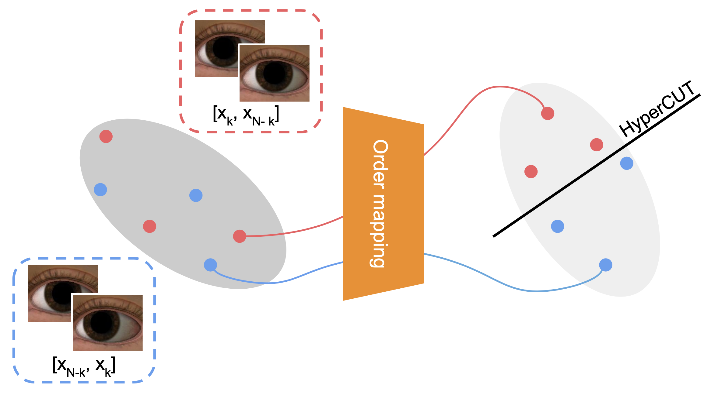

# HyperCUT: Video Sequence from a Single Blurry Image using Unsupervised Ordering [(CVPR'23)](https://arxiv.org/abs/2304.01686)

<a href="https://arxiv.org/abs/2304.01686"></a>

<div align="center">
  <a href="https://scholar.google.com/citations?hl=en&authuser=1&user=STehQhoAAAAJ" target="_blank">Bang-Dang&nbsp;Pham</a> &emsp; <b>&middot;</b> &emsp;
  <a href="https://scholar.google.com/citations?hl=en&authuser=1&user=-BPaFHcAAAAJ" target="_blank">Phong&nbsp;Tran</a> &emsp; 
  <b>&middot;</b> &emsp;
  <a href="https://sites.google.com/site/anhttranusc/" target="_blank">Anh&nbsp;Tran</a> &emsp; 
  <b>&middot;</b> &emsp;
  <a href="https://sites.google.com/view/cuongpham/home" target="_blank">Cuong&nbsp;Pham</a> &emsp; 
  <b>&middot;</b> &emsp;
  <a href="https://rangnguyen.github.io/" target="_blank">Rang&nbsp;Nguyen</a> &emsp; 
  <b>&middot;</b> &emsp;
  <a href="https://www3.cs.stonybrook.edu/~minhhoai/" target="_blank">Minh&nbsp;Hoai</a> &emsp; 
  <br> <br>
  <a href="https://www.vinai.io/">VinAI Research, Vietnam</a>
</div>
<br>
<div align="center">
    
</div>

<!-- [Tuan Duc Ngo](https://ngoductuanlhp.github.io/),
[Binh-Son Hua](https://sonhua.github.io/),
[Khoi Nguyen](https://www.khoinguyen.org/)<br>
VinAI Research, Vietnam -->

<!-- > **Abstract**: 
Existing 3D instance segmentation methods are predominant by a bottom-up design: a manually fine-tuned algorithm to group points into clusters followed by a refinement network. Relying on the quality of the clusters, these methods generate susceptible results when (1) nearby objects with the same semantic class are packed together, or (2) large objects with complex shapes. To address these shortcomings, we introduce ISBNet, a novel cluster-free method that represents instances as kernels and decodes instance masks via dynamic convolution. To efficiently generate a high-recall and discriminative kernel set, we propose a simple strategy, named Instance-aware Farthest Point Sampling, to sample candidates and leverage the point aggregation layer adopted from PointNet++ to encode candidate features. Moreover, we show that training 3D instance segmentation in a multi-task learning setting with an additional axis-aligned bounding box prediction head further boosts performance. Our method set new state-of-the-art results on ScanNetV2 (55.9), S3DIS (60.8), and STPLS3D (49.2) in terms of AP and retains fast inference time (237ms per scene on ScanNetV2).
 -->


> **Abstract**: We consider the challenging task of training models for image-to-video deblurring, which aims to recover a sequence of sharp images corresponding to a given blurry image input. A critical issue disturbing the training of an image-to-video model is the ambiguity of the frame ordering since both the forward and backward sequences are plausible solutions. This paper proposes an effective self-supervised ordering scheme that allows training high-quality image-to-video deblurring models. Unlike previous methods that rely on order-invariant losses, we assign an explicit order for each video sequence, thus avoiding the order-ambiguity issue. Specifically, we map each video sequence to a vector in a latent high-dimensional space so that there exists a hyperplane such that for every video sequence, the vectors extracted from it and its reversed sequence are on different sides of the hyperplane. The side of the vectors will be used to define the order of the corresponding sequence. Last but not least, we propose a real-image dataset for the image-to-video deblurring problem that covers a variety of popular domains, including face, hand, and street. Extensive experimental results confirm the effectiveness of our method.
<!--  -->

Details of the model architecture and experimental results can be found in [our paper](https://arxiv.org/abs/2304.01686):

```bibtext
@inproceedings{dangpb2023hypercut,
 author={Bang-Dang Pham, Phong Tran, Anh Tran, Cuong Pham, Rang Nguyen, Minh Hoai},
 booktitle={Proceedings of the IEEE/CVF Conference on Computer Vision and Pattern Recognition (CVPR)},
 title={HyperCUT: Video Sequence from a Single Blurry Image using Unsupervised Ordering},
 year={2023}
}
```

**Please CITE** our paper whenever this repository is used to help produce published results or incorporated into other software.

## Table of contents
1. [Getting Started](#getting-started)
2. [Datasets](#datasets)
3. [HyperCUT Ordering](#hypercut-ordering)
4. [Deblurring Model](#deblurring-model)
5. [Results](#results)
6. [References](#references)
7. [Contacts](#Contacts)

## Getting Started

### Prerequisites
- Python >= 3.7
- Python >= 1.9.0
- CUDA >= 10.0


### Installation
Install dependencies:
```shell
git clone https://github.com/VinAIResearch/HyperCUT.git
cd HyperCUT

conda create -n hypercut python=3.9  
conda activate hypercut  
pip install -r requirements.txt  
```

## Datasets :floppy_disk:
### Data Preperation
Download datasets REDS and BAist++ then unzip to folder `./dataset` and organize following this format:
```
root
├── 000000
    ├── blur
    ├──── 0000.png
    ├──── ...
    ├── sharp
    ├──── 0000_1.png
    ├──── 0000_2.png
    ├──── ...
    ├──── 0000_6.png
    ├──── 0000_7.png
├── 000001
    ├── blur
    ├──── 0000.png
    ├──── ...
    ├── sharp
    ├──── 0000_1.png
    ├──── 0000_2.png
    ├──── ...
    ├──── 0000_6.png
    ├──── 0000_7.png
├── ...
├── metadata.json

```

where `root` is the name of dataset. The `metadata.json` file is the compulsory for each dataset. You can create by your own but it have to follow this format:
```.bash
{
    "name": "Street",
    "frame_per_seq": 7,
    "data": [
        {
            "id": "00000/0000",
            "order": "ignore",
            "partition": "train",
            "blur_path": "00000/blur/0000.png", #path_to_image
            "frame001_path": "00000/sharp/0000_1.png", 
            "frame002_path": "00000/sharp/0000_2.png",
            "frame003_path": "00000/sharp/0000_3.png",
            "frame004_path": "00000/sharp/0000_4.png",
            "frame005_path": "00000/sharp/0000_5.png",
            "frame006_path": "00000/sharp/0000_6.png",
            "frame007_path": "00000/sharp/0000_7.png"
        },
		{
			...
		}

	]
}
```
In this format, the attribute `order` has total 3 value `[ignore, reverse, random]` which define the order of sharp images and our HyperCUT would identify the value `ignore` or `reverse` (more detailed in section [HyperCUT Ordering](#training)). 

## HyperCUT Ordering

### Training
Before training our HyperCUT, you can set the atrribute `order` of each sample in `metatdata.json` file is `ignore` by default, then use the following script to train the model:

```.bash
python train_hypercut.py --dataset_name dataname --metadata_root path/to/metadata.json
```
### Evalutation
You can run this script to evaluate *`hit`* and *`con`* ratio that are mentioned in our paper:

```.bash
python test_hypercut.py --dataset_name dataname \
			--metadata_root path/to/metadata.json \
			--pretrained_path path/to/pretrained_HyperCUT.pth \
```

### Using HyperCUT
After training HyperCUT, you can use our pretrained model to generate a new `order` for each sample using this script:
```.bash
python generate_order.py --dataset_name dataname \
			--metadata_root path/to/metadata.json \
    			--save_path path/to/generated_metadata.json \
    			--pretrained_path path/to/pretrained_HyperCUT.pth \
```

## Deblurring Model

### Training
You can train deblurring networks using `train_blur2vid.py`. For example:
```.bash
# Train baseline model
python train_blur2vid.py --dataset_name dataname \
			--metadata_root path/to/generated_metadata.json \
			--batch_size 8 \
    			--backbone Jin \
    			--loss_type order_inv \
    			--target_frames 1 2 3 4 5 6 7 \

# Train baseline + HyperCUT model
python train_blur2vid.py --dataset_name dataname \
			--metadata_root path/to/generated_metadata.json \
			--batch_size 8 \
			--backbone Jin \ 
    			--loss_type hypercut \
			--hypercut_path path/to/pretrained_HyperCUT.pth \
    			--target_frames 1 2 3 4 5 6 7 \						
```
In this project, we offer configurable arguments for training different baselines either with their original settings or incorporating our HyperCUT regularization. The key arguments to consider are:
- `backbone`: This current version of the code incorporates two baseline methods - those proposed by Jin et al. [[1]](#references)  and Purohit et al. [[2]](#references) , located under `./models/backbones/`. The training process of the deblurring network can be tailored to employ either of these methods by setting the `backbone` value to `Jin` or `Purohit`, respectively.
- `loss_type`: We implement 3 version of loss functions that are mentioned in our main paper. These are: Naive loss (`naive`), Order-Invariant loss (`order_inv`), and our novel HyperCUT regularization (`hypercut`). Should you opt to utilize the HyperCUT method, please ensure that the `hypercut_path` is correctly specified, as demonstrated in the provided bash file above.

### Evaluation
Like the training process, you can evaluate the deblurring model with 2 config:
```.bash
# Evaluate baseline model
python test_blur2vid.py --dataset_name dataname \
			--metadata_root path/to/generated_metadata.json \
			--batch_size 8 \
			--backbone Jin \
			--target_frames 1 2 3 4 5 6 7 \

# Evaluate baseline + HyperCUT model
python test_blur2vid.py --dataset_name dataname \
			--metadata_root path/to/generated_metadata.json \
			--batch_size 8 \
			--backbone Jin \ 
			--hypercut_path path/to/pretrained_HyperCUT.pth \
			--target_frames 1 2 3 4 5 6 7 \						
```

## Results
To ensure a fair evaluation, we adopt the maximum value from the results of both forward and backward predictions for each metric - $\mathrm{PSNR}, \mathrm{SSIM}$ and $\mathrm{LPIPS}$.

Table 1: Performance boost (pPSNR↑) of each frame on REDS (left) and RB2V-Street (average of all three categories) dataset when using HyperCUT

| Model | $1^{st}$ frame | $2^{nd}$ frame | $3^{rd}$ frame | $4^{th}$ frame | $5^{th}$ frame | $6^{th}$ frame | $7^{th}$ frame |
| -------------------------- | :---------------: | :---: | :---: | :---: | :---: |:---: |:---: |
| Purohit et al. [[2]](#references) | 22.78/26.99 | 24.47/27.99 | 26.14/29.45 | 31.50/**32.08** | 26.12/29.55 | 24.49/28.06 | 22.83/27.04 |
| Purohit et al. [[2]](#references) + Ours| **26.75/28.29** | **28.30/29.20** | **29.42/30.43** | **29.97/32.08**| **29.41/30.53** | **28.30/29.22** | **26.76/28.25**|


## References
[1] Meiguang Jin, Givi Meishvili, and Paolo Favaro. Learning to extract a video sequence from a single motion-blurred image. In Proceedings of the IEEE Conference on Computer Vision and Pattern Recognition, 2018.

[2] Kuldeep Purohit, Anshul Shah, and AN Rajagopalan. Bringing alive blurred moments. In Proceedings of the IEEE Conference on Computer Vision and Pattern Recognition, 2019.

## Contacts :email:
If you have any questions or suggestions about this repo, please feel free to contact me (bangdang2000@gmail.com).
